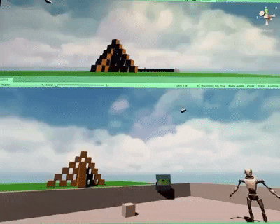

# VR Drone Simulator
This is my C# logic from a drone simulation game I have been working on for Oculus Quest VR headsets. Currently the drone is implemented and flying over the battlefield on an autpilot course. Projectiles can be fired from the drone, and physics have been implemented to reflect velocity, trajectory, and impact. There is a CCTV-style screen at the player cockpit displaying a real-time view from the drone's gimbal. The VR Skeleton is rigged with inverse kinematics.

## Future Development
- Smooth IK leg rigging
- Despawn projectiles on contact
- Implement VR cockpit controls
- Implement manual flight controls and mounted camera gimbal controls
- Add production effects
- Add production assets

Designed for Oculus Quest VR headsets with Unity

